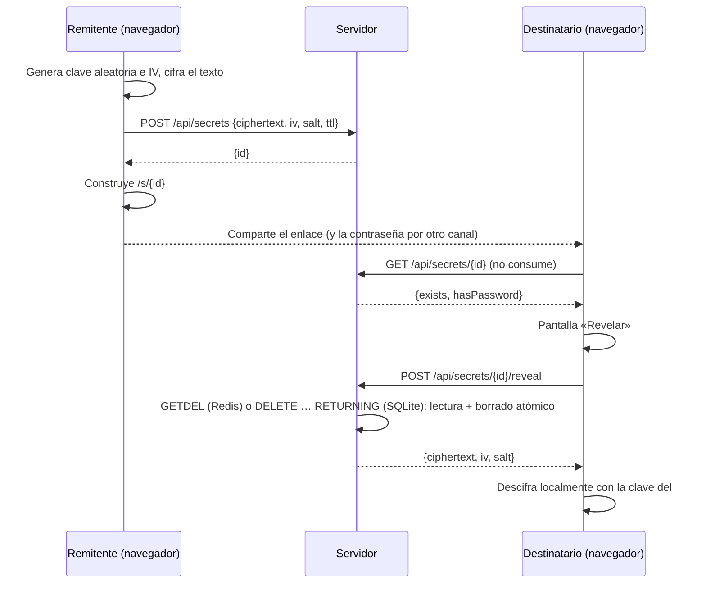

# WhisperLink

Comparte secretos mediante enlaces de **un solo uso**, cifrados de extremo a extremo en el navegador.

El texto se cifra en tu navegador con la [Web Crypto API](https://developer.mozilla.org/es/docs/Web/API/Web_Crypto_API). La clave viaja en el fragmento de la URL (lo que va después de `#`), que los navegadores **nunca envían al servidor**. El servidor solo guarda datos cifrados que no puede leer, y los borra en cuanto alguien los revela.

```
https://tu-dominio/s/scWKvQRQzkDczr1Ab9oH0A#iKWXA1uk2J4sI98kAE6UNJ9L2b_InNSQ1flai2BYSHE
                     └──── id (servidor) ───┘ └───────── clave (solo navegador) ──────────┘
```

## Características

- 🔐 **Cifrado en el cliente**: AES-256-GCM con una clave aleatoria de 256 bits generada en el navegador.
- 🔥 **Un solo uso**: el secreto se lee y se borra de forma atómica; una segunda lectura devuelve 404.
- 🔑 **Contraseña opcional**: segunda capa de protección; hacen falta el enlace **y** la contraseña.
- ⏳ **Caducidad**: 1 hora, 1 día o 7 días, aunque nadie lo haya leído.
- 🛡️ **Resistente a previsualizaciones**: abrir el enlace no consume el secreto; hay que pulsar «Revelar». Los bots de Slack, WhatsApp o Teams que generan vistas previas no lo queman.
- 📦 **Cero dependencias**: solo Node.js (`node:http` + `node:sqlite`) y HTML/JS vanilla. Sin `npm install`.
- ▲ **Listo para Vercel**: funciones serverless + Upstash Redis, o servidor propio con SQLite.

## Desplegar en Vercel

[](https://vercel.com/new/clone?repository-url=https://github.com/<tu-usuario>/whisperlink)

Las funciones de Vercel no tienen disco persistente, así que en Vercel los secretos se guardan en **Upstash Redis** (hay plan gratuito). Redis encaja muy bien: `SET … PX` gestiona la caducidad y `GETDEL` lee y borra en una sola operación atómica.

1. Sube el repositorio a GitHub e impórtalo en [vercel.com/new](https://vercel.com/new). No hace falta configurar nada: `vercel.json` ya lo define todo.
2. En el proyecto, ve a **Storage → Create Database → Upstash (Redis)** y conéctalo. Vercel añade solas las variables `KV_REST_API_URL` y `KV_REST_API_TOKEN`.
3. Vuelve a desplegar (**Deployments → Redeploy**) para que la función lea las variables.

También puedes usar una base de [console.upstash.com](https://console.upstash.com) y definir a mano `UPSTASH_REDIS_REST_URL` y `UPSTASH_REDIS_REST_TOKEN`.

Si falta la base de datos, la API responde `503 Almacenamiento no configurado` y el log de la función indica qué variable falta.

Desde la terminal:

```bash
npm i -g vercel
vercel link          # vincula la carpeta al proyecto
vercel env pull      # descarga las variables de Redis a .env.local
vercel --prod        # despliega
```

### Cómo se reparte en Vercel

| Petición                   | Quién la atiende                                          |
|----------------------------|-----------------------------------------------------------|
| `/`, `/*.js`, `/style.css` | CDN de Vercel (archivos de `public/`)                     |
| `/s/:id`                   | CDN, reescrito a `view.html`                              |
| `/api/*`                   | Función serverless `api/index.js` → Redis                 |

Las cabeceras de seguridad se aplican a todo desde `vercel.json`. Un test comprueba que coinciden con las del servidor local.

## Inicio rápido (local)

Requisitos: **Node.js ≥ 22.13** (se recomienda Node 24).

```bash
git clone https://github.com/<tu-usuario>/whisperlink.git
cd whisperlink
npm start
```

Abre <http://localhost:3000>.

### Variables de entorno

| Variable                                              | Por defecto      | Descripción                                                        |
|-------------------------------------------------------|------------------|--------------------------------------------------------------------|
| `PORT`                                                | `3000`           | Puerto HTTP                                                        |
| `DB_PATH`                                             | `whisperlink.db` | Ruta del archivo SQLite (si no se usa Redis)                       |
| `KV_REST_API_URL` / `KV_REST_API_TOKEN`               | —                | Credenciales de Upstash Redis (las crea Vercel)                    |
| `UPSTASH_REDIS_REST_URL` / `UPSTASH_REDIS_REST_TOKEN` | —                | Alternativa con los nombres de Upstash                             |
| `TRUST_PROXY`                                         | —                | `1` para tomar la IP de `X-Real-IP` / `X-Forwarded-For` (detrás de un proxy) |

Si hay credenciales de Redis en el entorno, el servidor local las usa. Si no, usa SQLite. En Vercel siempre se usa Redis y la IP del proxy de Vercel.

```bash
PORT=8080 DB_PATH=/var/lib/whisperlink/data.db npm start
```

> Al arrancar, Node muestra `ExperimentalWarning: SQLite is an experimental feature`. Es inofensivo.

## Cómo funciona



### Criptografía

| Elemento            | Detalle                                                              |
|---------------------|----------------------------------------------------------------------|
| Clave del enlace    | 32 bytes aleatorios (`crypto.getRandomValues`), codificados en base64url |
| Cifrado             | AES-256-GCM, IV aleatorio de 12 bytes por secreto                    |
| Contraseña          | PBKDF2-SHA256, 600 000 iteraciones, salt aleatorio de 16 bytes       |
| Clave final         | `HKDF-SHA256(ikm = clave del enlace, salt = PBKDF2(contraseña) o vacío, info = "whisperlink-v1")` |

Sin contraseña, el salt de HKDF está vacío; con contraseña, se mezcla el resultado de PBKDF2. Así, quien solo tenga el enlace no puede descifrar un secreto protegido con contraseña, y la contraseña sola tampoco sirve.

Al servidor solo llegan `ciphertext`, `iv`, `salt` (o `null`) y `ttl`. **Nunca** la clave ni la contraseña.

### Contraseña incorrecta

El secreto se descarga (y se borra del servidor) al pulsar «Revelar». Si la contraseña es incorrecta, el texto cifrado **se queda en memoria** en la página para que el destinatario pueda reintentar sin pedirlo otra vez al servidor. Si recarga o cierra la página antes de acertar, el secreto se pierde; la interfaz lo avisa.

## API

Todas las respuestas son JSON.

### `POST /api/secrets`

Crea un secreto.

```json
{
  "ciphertext": "<base64url, máx. ~90 000 caracteres>",
  "iv": "<base64url, 12 bytes>",
  "salt": "<base64url, 16 bytes> | null",
  "ttl": "1h | 1d | 7d"
}
```

| Respuesta | Significado                                   |
|-----------|-----------------------------------------------|
| `201`     | `{ "id": "<22 caracteres base64url>" }`       |
| `400`     | Campos inválidos                              |
| `413`     | Secreto demasiado grande                      |
| `415`     | `Content-Type` distinto de `application/json` |
| `429`     | Límite de peticiones superado                 |

### `GET /api/secrets/:id`

Devuelve metadatos **sin consumir** el secreto: `{ "exists": true, "hasPassword": false }`, o `404` si no existe, ya se leyó o caducó.

### `POST /api/secrets/:id/reveal`

Devuelve `{ ciphertext, iv, salt }` y **borra** el secreto en la misma operación. Las llamadas siguientes devuelven `404`. Es `POST` (un `GET` devuelve `405`) para que los rastreadores y previsualizadores no puedan consumirlo.

## Seguridad

### Medidas incluidas

- **Lectura y borrado atómicos** con `GETDEL` en Redis o `DELETE … RETURNING` en SQLite: dos peticiones simultáneas nunca obtienen el mismo secreto.
- **La clave sale de la barra de direcciones** (`history.replaceState`) en cuanto carga la página, así que no queda en el historial.
- **Cabeceras estrictas**: CSP sin scripts inline (`script-src 'self'`), `Referrer-Policy: no-referrer`, `Cache-Control: no-store`, `X-Frame-Options: DENY`, `X-Content-Type-Options: nosniff`, `Cross-Origin-Opener-Policy: same-origin`.
- **El texto descifrado se muestra con `textContent`** (nunca `innerHTML`), sin riesgo de XSS.
- **Validación estricta** del formato y del tamaño de las entradas (cuerpo máximo de 100 KB).
- **Límite de peticiones**: 30 `POST` por minuto e IP. Se guarda en Redis (compartido entre instancias serverless) o en memoria con SQLite.
- **Logs sin ids**: el servidor registra solo el método, la ruta (con el id sustituido por `:id`) y el código de estado.
- **Ids aleatorios de 128 bits**, imposibles de adivinar.

### Modelo de amenazas y limitaciones

- **Hay que confiar en el servidor que entrega el JavaScript.** Un servidor comprometido podría servir código que filtre la clave. Es una limitación inherente a cualquier cifrado E2E hecho en una web.
- **Quien intercepte el enlace completo** antes que el destinatario puede leer el secreto (salvo que tenga contraseña). El destinatario lo notará porque el enlace ya no funcionará. Para datos sensibles, usa contraseña y compártela por otro canal.
- **Un solo uso no impide que el destinatario copie el secreto.** Lo que garantiza es que solo se lee una vez a través de WhisperLink.
- **Proxy en un servidor propio:** detrás de un proxy inverso hay que activar `TRUST_PROXY=1`. Si no, todas las peticiones parecen venir de la misma IP. Actívalo **solo** detrás de un proxy, porque un cliente podría falsificar esas cabeceras.
- **Datos guardados en Upstash:** en Vercel, Upstash almacena el texto cifrado. Sin la clave del enlace no puede leerlo.

## Despliegue en servidor propio

- **HTTPS es obligatorio** fuera de `localhost`: los navegadores solo exponen `crypto.subtle` en contextos seguros (Vercel ya sirve HTTPS).
- Arranca con `TRUST_PROXY=1` si va detrás de un proxy.
- Ponlo detrás de un proxy inverso (Caddy, nginx, Traefik) que gestione TLS.
- Guarda `DB_PATH` en un volumen persistente si quieres que los secretos pendientes sobrevivan a un reinicio.
- Si tu proxy guarda logs de acceso, no pasa nada: el fragmento `#clave` nunca llega en la petición HTTP.

Ejemplo con Caddy:

```
secrets.example.com {
    reverse_proxy localhost:3000
}
```

## Estructura del proyecto

```
whisperlink/
├── server.js          # Servidor local: estáticos + API, elige SQLite o Redis, limpieza por TTL
├── vercel.json        # Vercel: carpeta de salida, reescrituras y cabeceras de seguridad
├── api/
│   └── index.js       # Función serverless de Vercel (usa Redis)
├── lib/
│   ├── handler.js     # API HTTP compartida: validación, límite de peticiones, cabeceras, logs
│   ├── sqlite-store.js# Almacén SQLite (node:sqlite)
│   └── redis-store.js # Almacén Upstash Redis vía REST (fetch, sin dependencias)
├── public/
│   ├── index.html     # Página para crear secretos
│   ├── create.js      # Cifra y envía el secreto
│   ├── view.html      # Página del destinatario (/s/:id)
│   ├── view.js        # Confirmación, revelado y descifrado
│   ├── crypto.js      # AES-GCM, PBKDF2, HKDF y base64url (compartido con los tests)
│   └── style.css      # Estilos con modo claro y oscuro
└── test/
    ├── crypto.test.js # Cifrar y descifrar con y sin contraseña, claves erróneas
    ├── db.test.js     # Almacén SQLite: un solo uso, caducidad, purga
    ├── redis.test.js  # Almacén Redis contra un Upstash simulado, flujo HTTP, vercel.json
    └── api.test.js    # Flujo HTTP completo, validación, cabeceras
```

## Tests

```bash
npm test
```

Usa el runner nativo `node:test`. Node incluye la Web Crypto API de forma global, así que `public/crypto.js` se prueba tal cual, sin mocks. El almacén Redis se prueba contra una imitación en memoria de la API REST de Upstash, así que no hace falta ninguna cuenta.

## Contribuir

1. Haz un fork y crea una rama: `git checkout -b mi-mejora`
2. Asegúrate de que `npm test` pasa
3. Abre un pull request explicando el cambio

Ideas pendientes: adjuntar archivos, CLI para crear secretos desde la terminal, imagen Docker.
