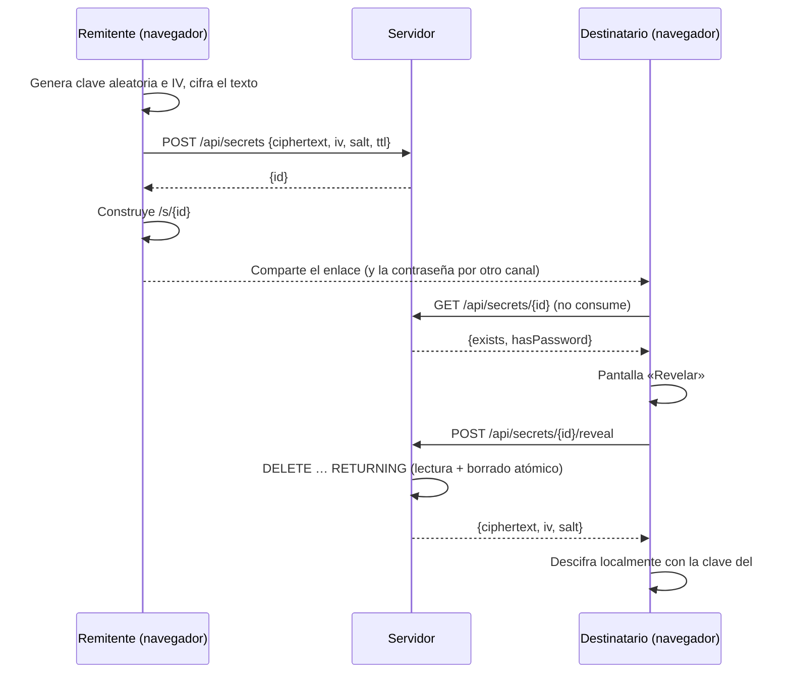

# WhisperLink

Comparte secretos mediante enlaces de **un solo uso**, cifrados de extremo a extremo en el navegador.

El texto se cifra en tu navegador con la [Web Crypto API](https://developer.mozilla.org/es/docs/Web/API/Web_Crypto_API). La clave viaja en el fragmento de la URL (lo que va después de `#`), que los navegadores **nunca envían al servidor**. El servidor solo guarda datos cifrados que no puede leer, y los borra en cuanto alguien los revela.

```
https://tu-dominio/s/scWKvQRQzkDczr1Ab9oH0A#iKWXA1uk2J4sI98kAE6UNJ9L2b_InNSQ1flai2BYSHE
                     └──── id (servidor) ───┘ └───────── clave (solo navegador) ──────────┘
```

## Características

- 🔐 **Cifrado en el cliente**: AES-256-GCM con una clave aleatoria de 256 bits generada en el navegador.
- 🔥 **Un solo uso**: el secreto se lee y se borra de forma atómica; una segunda lectura devuelve 404.
- 🔑 **Contraseña opcional**: segunda capa de protección; hacen falta el enlace **y** la contraseña.
- ⏳ **Caducidad**: 1 hora, 1 día o 7 días, aunque nadie lo haya leído.
- 🛡️ **Resistente a previsualizaciones**: abrir el enlace no consume el secreto; hay que pulsar «Revelar». Los bots de Slack, WhatsApp o Teams que generan vistas previas no lo queman.
- 📦 **Cero dependencias**: solo Node.js (`node:http` + `node:sqlite`) y HTML/JS vanilla. Sin `npm install`.

## Inicio rápido

Requisitos: **Node.js ≥ 22.13** (se recomienda Node 24).

```bash
git clone https://github.com/<tu-usuario>/whisperlink.git
cd whisperlink
npm start
```

Abre <http://localhost:3000>.

### Variables de entorno

| Variable  | Por defecto      | Descripción                          |
|-----------|------------------|--------------------------------------|
| `PORT`    | `3000`           | Puerto HTTP                          |
| `DB_PATH` | `whisperlink.db` | Ruta del archivo de la base SQLite   |

```bash
PORT=8080 DB_PATH=/var/lib/whisperlink/data.db npm start
```

> Al arrancar, Node muestra `ExperimentalWarning: SQLite is an experimental feature`. Es inofensivo.

## Cómo funciona



### Criptografía

| Elemento            | Detalle                                                              |
|---------------------|----------------------------------------------------------------------|
| Clave del enlace    | 32 bytes aleatorios (`crypto.getRandomValues`), codificados en base64url |
| Cifrado             | AES-256-GCM, IV aleatorio de 12 bytes por secreto                    |
| Contraseña          | PBKDF2-SHA256, 600 000 iteraciones, salt aleatorio de 16 bytes       |
| Clave final         | `HKDF-SHA256(ikm = clave del enlace, salt = PBKDF2(contraseña) o vacío, info = "whisperlink-v1")` |

Sin contraseña, el salt de HKDF está vacío; con contraseña, se mezcla el resultado de PBKDF2. Así, quien solo tenga el enlace no puede descifrar un secreto protegido con contraseña, y la contraseña sola tampoco sirve.

Al servidor solo llegan `ciphertext`, `iv`, `salt` (o `null`) y `ttl`. **Nunca** la clave ni la contraseña.

### Contraseña incorrecta

El secreto se descarga (y se borra del servidor) al pulsar «Revelar». Si la contraseña es incorrecta, el texto cifrado **se queda en memoria** en la página para que el destinatario pueda reintentar sin pedirlo otra vez al servidor. Si recarga o cierra la página antes de acertar, el secreto se pierde; la interfaz lo avisa.

## API

Todas las respuestas son JSON.

### `POST /api/secrets`

Crea un secreto.

```json
{
  "ciphertext": "<base64url, máx. ~90 000 caracteres>",
  "iv": "<base64url, 12 bytes>",
  "salt": "<base64url, 16 bytes> | null",
  "ttl": "1h | 1d | 7d"
}
```

| Respuesta | Significado                                   |
|-----------|-----------------------------------------------|
| `201`     | `{ "id": "<22 caracteres base64url>" }`       |
| `400`     | Campos inválidos                              |
| `413`     | Secreto demasiado grande                      |
| `415`     | `Content-Type` distinto de `application/json` |
| `429`     | Límite de peticiones superado                 |

### `GET /api/secrets/:id`

Devuelve metadatos **sin consumir** el secreto: `{ "exists": true, "hasPassword": false }`, o `404` si no existe, ya se leyó o caducó.

### `POST /api/secrets/:id/reveal`

Devuelve `{ ciphertext, iv, salt }` y **borra** el secreto en la misma operación. Las llamadas siguientes devuelven `404`. Es `POST` (un `GET` devuelve `405`) para que los rastreadores y previsualizadores no puedan consumirlo.

## Seguridad

### Medidas incluidas

- **Lectura y borrado atómicos** con `DELETE … RETURNING`: dos peticiones simultáneas nunca obtienen el mismo secreto.
- **La clave sale de la barra de direcciones** (`history.replaceState`) en cuanto carga la página, así que no queda en el historial.
- **Cabeceras estrictas**: CSP sin scripts inline (`script-src 'self'`), `Referrer-Policy: no-referrer`, `Cache-Control: no-store`, `X-Frame-Options: DENY`, `X-Content-Type-Options: nosniff`, `Cross-Origin-Opener-Policy: same-origin`.
- **El texto descifrado se muestra con `textContent`** (nunca `innerHTML`), sin riesgo de XSS.
- **Validación estricta** del formato y del tamaño de las entradas (cuerpo máximo de 100 KB).
- **Límite de peticiones** en memoria: 30 `POST` por minuto e IP.
- **Logs sin ids**: el servidor registra solo el método, la ruta (con el id sustituido por `:id`) y el código de estado.
- **Ids aleatorios de 128 bits**, imposibles de adivinar.

### Modelo de amenazas y limitaciones

- **Hay que confiar en el servidor que entrega el JavaScript.** Un servidor comprometido podría servir código que filtre la clave. Es una limitación inherente a cualquier cifrado E2E hecho en una web.
- **Quien intercepte el enlace completo** antes que el destinatario puede leer el secreto (salvo que tenga contraseña). El destinatario lo notará porque el enlace ya no funcionará. Para datos sensibles, usa contraseña y compártela por otro canal.
- **Un solo uso no impide que el destinatario copie el secreto.** Lo que garantiza es que solo se lee una vez a través de WhisperLink.
- **El límite de peticiones usa la IP de la conexión.** Detrás de un proxy inverso habría que leer `X-Forwarded-For`.

## Despliegue

- **HTTPS es obligatorio** fuera de `localhost`: los navegadores solo exponen `crypto.subtle` en contextos seguros.
- Ponlo detrás de un proxy inverso (Caddy, nginx, Traefik) que gestione TLS.
- Guarda `DB_PATH` en un volumen persistente si quieres que los secretos pendientes sobrevivan a un reinicio.
- Si tu proxy guarda logs de acceso, no pasa nada: el fragmento `#clave` nunca llega en la petición HTTP.

Ejemplo con Caddy:

```
secrets.example.com {
    reverse_proxy localhost:3000
}
```

## Estructura del proyecto

```
whisperlink/
├── server.js          # Servidor HTTP: API, archivos estáticos, cabeceras, límite de peticiones, limpieza por TTL
├── db.js              # Acceso a SQLite (node:sqlite): create / meta / consume / purge
├── public/
│   ├── index.html     # Página para crear secretos
│   ├── create.js      # Cifra y envía el secreto
│   ├── view.html      # Página del destinatario (/s/:id)
│   ├── view.js        # Confirmación, revelado y descifrado
│   ├── crypto.js      # AES-GCM, PBKDF2, HKDF y base64url (compartido con los tests)
│   └── style.css      # Estilos con modo claro y oscuro
└── test/
    ├── crypto.test.js # Cifrar y descifrar con y sin contraseña, claves erróneas
    ├── db.test.js     # Un solo uso, caducidad, purga
    └── api.test.js    # Flujo HTTP completo, validación, cabeceras
```

## Tests

```bash
npm test
```

Usa el runner nativo `node:test`. Node incluye la Web Crypto API de forma global, así que `public/crypto.js` se prueba tal cual, sin mocks.

## Contribuir

1. Haz un fork y crea una rama: `git checkout -b mi-mejora`
2. Asegúrate de que `npm test` pasa
3. Abre un pull request explicando el cambio

Ideas pendientes: soporte para `X-Forwarded-For`, adjuntar archivos, CLI para crear secretos desde la terminal, imagen Docker.
